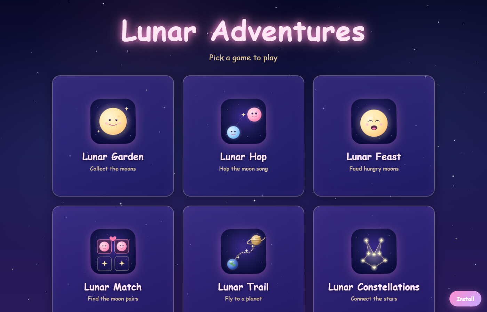

# Lunar Adventures

A gentle collection of moon-themed games for little explorers. Built as a
static PWA — installable from any browser and works offline.



## Games

- **Lunar Garden** — collect moons across the night sky
- **Lunar Hop** — hop along a moon song
- **Lunar Feast** — feed hungry moons their favourite stars
- **Lunar Match** — find the moon pairs
- **Lunar Phases** — drag each moon to grow from new to full
- **Lunar Constellations** — connect numbered stars to reveal a hidden shape
- **Lunar Trail** — fly a spaceship from Earth to a different planet each round

## Run locally

```bash
python -m http.server 8000
```

Then open <http://localhost:8000>.
